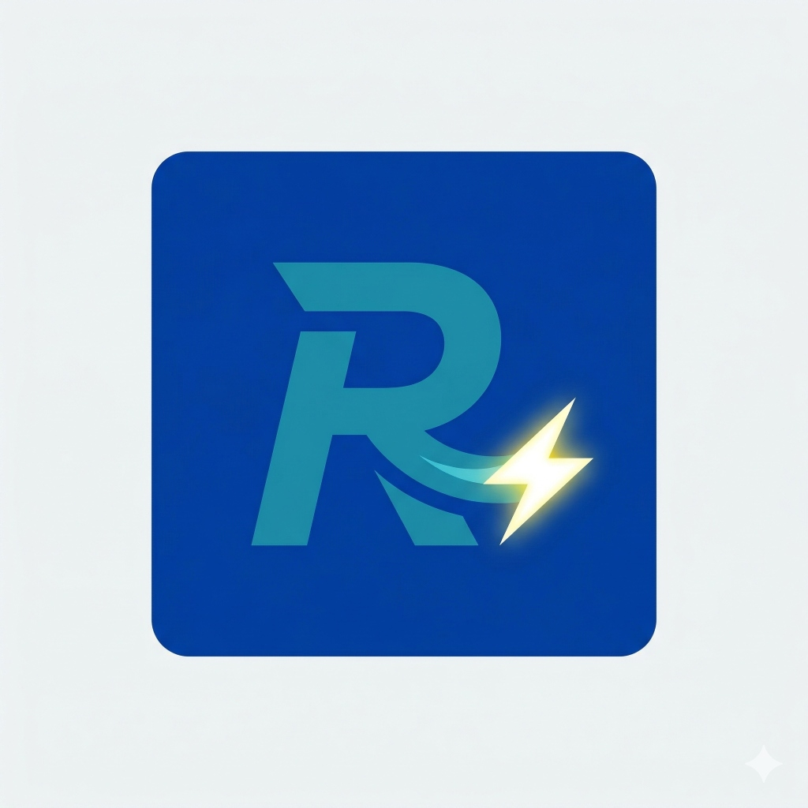
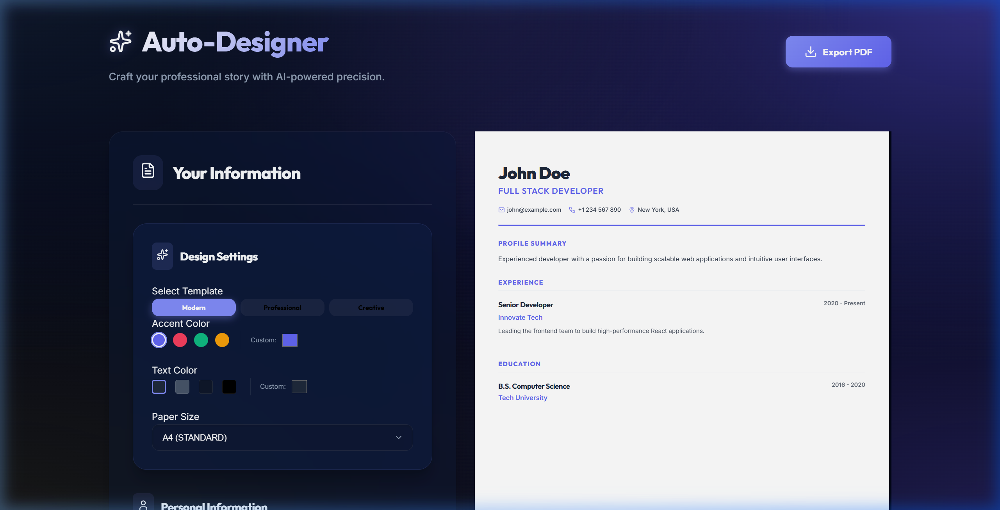
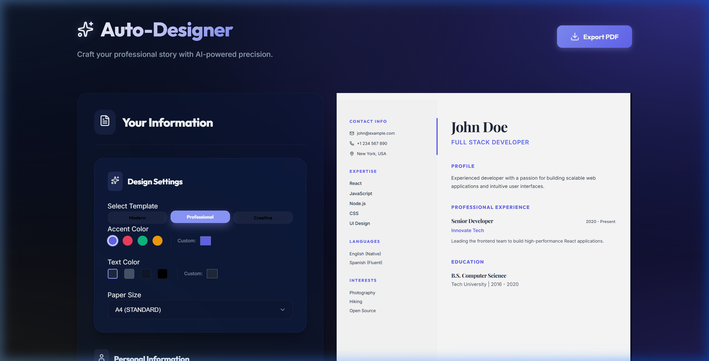
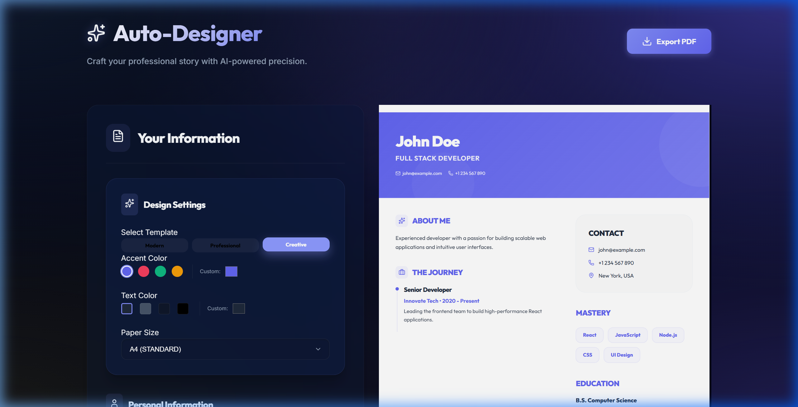

<div align="center">
  
  <h1>CV Auto-Designer</h1>
  <p><strong>Craft your professional story with AI-powered precision.</strong></p>
  
  [](https://cv-template-tan.vercel.app/)
  [](https://react.dev/)
  [](https://vitejs.dev/)
</div>

---

## 🌟 Overview

**CV Auto-Designer** is a premium, high-performance web application designed to help professionals create stunning, modern resumes in seconds. Built with a focus on **visual excellence** and **technical stability**, it bridges the gap between sophisticated design and reliable document generation.

## 🎨 Theme Showcase

````carousel

<!-- slide -->

<!-- slide -->

````

## 🚀 Key Features

- **Triple-Aesthetic Engine**: Toggle instantly between **Modern**, **Professional**, and **Creative** templates, each with distinct typography and layout hierarchies.
- **Dynamic Color Orchestration**:
  - **Accent Control**: Real-time picker for primary theme highlights.
  - **Text Precision**: Independent control over text color for maximum readability.
- **Universal Paper Support**: One-click formatting for **A4, US Letter, A3, Legal, and Tabloid**.
- **Stabilized PDF Generator**: A custom rendering layer for `html2canvas` that ensures pixel-perfect exports even from mobile devices (A4 ratio preservation).
- **Glassmorphism UI**: A premium dashboard experience with an animated background and translucent components.

## 🛠️ Technical Deep-Dive

### PDF Export Stabilization
Generating PDFs from a responsive web layout can be challenging. This project implements a **virtual viewport capture** method:
1.  Temporarily strips all CSS transforms and viewport constraints from a cloned DOM element.
2.  Forces a fixed virtual desktop width (e.g., 794px for A4) to ensure font scaling and layout ratios are preserved.
3.  Simulates a 2x DPI capture to provide high-resolution results for printing.

### Tech Stack
- **Framework**: React 19 (Functional Components & Hooks)
- **Icons**: Lucide React (Standardized Vector Set)
- **Engine**: jsPDF + html2canvas (Custom Integration)
- **Styling**: Modern Vanilla CSS (Custom Variables & Animations)

## 📦 Getting Started

### Local Development
1. **Clone & Enter**:
   ```bash
   git clone https://github.com/sutsengdu/cv_template.git
   cd cv_template
   ```
2. **Install**:
   ```bash
   npm install
   ```
3. **Launch**:
   ```bash
   npm run dev
   ```

### Deployment (Vercel)
The easiest way to deploy is through Vercel:
1. Push your code to GitHub.
2. Import the project in the [Vercel Dashboard](https://vercel.com/dashboard).
3. Ensure the framework is set to **Vite**.
4. Click **Deploy**.

---

<div align="center">
  <p><strong>"built for people, not for profit"</strong></p>
  <p>© 2026 <a href="https://www.sutsengdu.com">sutsengdu.com</a></p>
</div>
